# UI / 动画改造建议（第四轮）

> 日期：2026-09-23　分支：`refactor/modular`　基线提交：`0d57721`
> **本文只出建议，未改动 UI 代码。** 全库只改了一行非 UI 代码 —— G-1 那条 `nan %` 的
> 数值校验修复（`InstallTask.swift:174`），详见第十八节。文中所有「已核实」结论都对应到
> 源码位置；「待真机确认」的条目请开一次应用对照。
> 文末**撤回**了本文自己的一条 P0 结论（原 C-1），理由见第〇节末。

---

## 〇、这份建议的可信度边界（先看这节，否则会误读截图）

### 截图是怎么来的

本机 `screencapture` 没有「屏幕录制」授权（辅助功能授权是另一回事），
直接截屏只能拿到桌面壁纸。因此改用**进程内离屏渲染**：把工程里真实的 SwiftUI
视图编进一个独立可执行文件，逐屏渲染成 PNG，共 25 张，放在 `docs/ui-review-shots/`。

两条绘制通道（各有取舍，最终混合使用）：

| 通道 | 做法 | 能画对什么 | 画不对什么 |
|---|---|---|---|
| `ImageRenderer` | SwiftUI 自带离屏渲染 | 布局 / 字号 / 间距 / 颜色 / 自绘形状 | AppKit 背书的子视图变成占位符（一个巨大的「禁止」图形 + 系统强调色底） |
| 真实但不显示的 `NSWindow` + `cacheDisplay` | 由 AppKit 自己绘制 | 毛玻璃（`NSVisualEffectView`）、文本输入框（`NSTextField`） | 触发不到 `onAppear` |

### 可信的部分

布局、层级与遮挡关系、对齐、字号、间距、颜色、真实文案、自绘形状、SF Symbols 图标 —— 这些**都可信**。

### 已核实为「渲染假象」，不是缺陷（请不要据此提需求）

1. **赞助页两张卡显示「图片缺失」** —— 已核实 `qwq/zanzhu1.png`、`qwq/zanzhu2.png`
   确实在构建产物的 `qwq.app/Contents/Resources/` 里（与 `Assets.car`、`stf.png` 同级）。
   离屏工具的 `Bundle.main` 指向工具自己，取不到图才走了兜底分支。**真机正常。**
2. **右下角电源按钮、任务药丸、info/success 两级通知横幅的截图是空白的** ——
   `CloseSessionButton.closeButtonScale` 初值 `0.01`、`TaskPill.opacity` 初值 `0`，
   它们的入场动画写在 `onAppear` 里，而离屏渲染不触发 `onAppear`，于是停在动画起始帧。
   这几个组件的**动效只能靠源码评审**（本文第 K、J 节就是这么做的）。
3. **下载页侧栏子项「正式版」文字不可见（只剩高亮块）** —— 同一条 `onAppear` 通道。
   `DownloadCategoryView.subItemOpacity` 初值为全 0（`GameViews.swift:21-23`），
   `onAppear` 里延迟 0.3s 用 spring 把它们推到 1（`GameViews.swift:70-76`）。
   离线渲染不触发 `onAppear` → 停在 0。**真机正常**，第 C-1 条已据此改写。
4. **info / success 两级横幅空白而 warning / error 正常** —— 同一组件同一条渲染路径，
   怀疑与这两级的自动消失计时有关，**待真机确认**。warning / error 的外观是真实的。

### 一个自我纠正：我一开始把第 3 条当成了 P0 缺陷

`docs/ui-review-shots/01-window-02-下载.png` 里，左侧栏「游戏」下面那个**高亮块可见、
文字不可见**。这里透明度由 `GameSidebarView.subItem(...)` 的一个外部字典驱动：

```swift
.opacity(subItemOpacity[sub] ?? 0)      // GameSidebarView.swift:92
```

我最初据此写了「P0：把 `?? 0` 改成 `?? 1`，否则标签会永久隐形」。**这个结论是错的**，
两条理由都在源码里：

1. 字典初值虽然全是 0，但**三个 case 一个不缺**（`GameViews.swift:21-23` 显式列出
   `.release / .snapshot / .ancient`，而 `GameSubCategory` 恰好只有这三个 case）。
   `??` 右侧只在「字典里没有这个 key」时才生效 —— 对现有三个 case 永远取不到，
   所以 `?? 0` 改成 `?? 1` 是**空操作**，一行也修不好。
2. 真机有回填：`onAppear` 里延迟 0.3s 把三个 key 都推到 1。截图之所以停在 0，
   是离屏渲染不触发 `onAppear`。

**结论：这条是渲染假象，不是缺陷。** 唯一残留价值是一条很轻的防御性建议：
将来给 `GameSubCategory` 加第四个 case 时，忘了同步改这个字典初值，
新标签就会静默隐形。若想根治，把初值改成由 `GameSubCategory.allCases` 派生即可
（但注意这**修不掉**上面第 2 条 —— 可见性仍然挂在 `onAppear` 的延迟回填上）。

---

## 一、主窗口 / 启动页

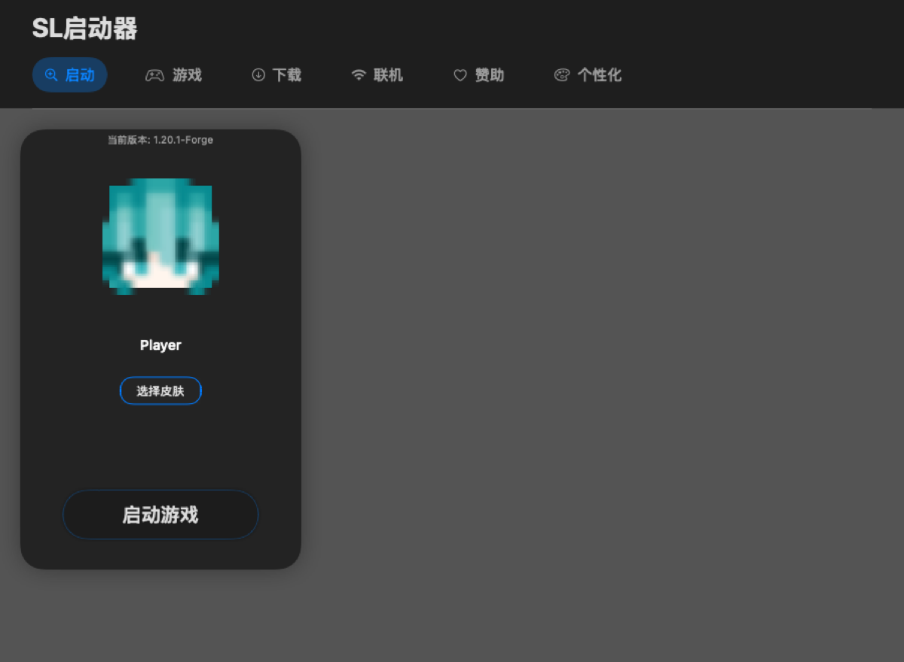

**所见**：标题「SL启动器」（`largeTitle.bold`）→ 分类导航 6 项（选中项为强调色胶囊）→
内容区一张 280pt 宽的深色卡片：`当前版本: 1.20.1-Forge`（12pt 次级色）→ 皮肤头像 →
用户名「Player」→「选择皮肤」描边胶囊 → 大段留白 → 底部「启动游戏」描边胶囊。

| # | 级别 | 问题 | 建议 |
|---|---|---|---|
| A-1 | P1 | **内容区右侧约 2/3 是空白。** 窗口默认 900×660、最小 800×590，而卡片恒为固定 280pt 宽且靠左。启动页是启动器的主界面，却把大部分面积闲置（日志面板只在启动后才出现）。 | 右侧放「最近实例 / 快速设置 / 公告」等信息，或让启动卡按可用宽度居中；至少给右侧一个明确的空态说明。 |
| A-2 | P2 | 「选择皮肤」与「启动游戏」之间约 180pt 的**硬留白**（卡片高度是 9 项常量累加出来的固定值），视觉上像「漏放了两个控件」。 | 用 `Spacer()` 或按内容自适应高度，不要用累加常量锁死。 |
| A-3 | P2 | 用户名输入区在未聚焦时**没有任何可见边界**，只有一行文本；与正下方有描边胶囊的「选择皮肤」相比，看不出它可点击/可编辑。 | 未聚焦时给 1pt 次级描边或浅底，聚焦时再切成强调色（现在只有聚焦态有描边）。 |
| A-4 | P2 | 卡片内唯一的说明文字「当前版本: 1.20.1-Forge」12pt 次级色、紧贴卡片顶部（上内边距约 20pt）。 | 提到 13pt，并让「当前版本」与版本号有主次对比（标签次级 + 版本值主色）。 |

---

## 二、游戏页

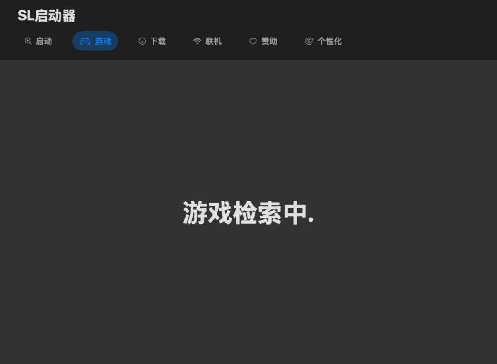

**所见**：整页只有居中的「游戏检索中.」（48pt bold），没有任何转圈、骨架屏或取消入口。

| # | 级别 | 问题 | 建议 |
|---|---|---|---|
| B-1 | P1 | **加载态是「48pt 巨字 + 手写省略号」**：`GameCategoryView` 用 0.5s 计时器让点号在 1→4 之间循环。它既不反映真实进度，又与全应用其它加载态（`ProgressView`）不是同一套语言。 | 换成 `ProgressView` + 一行 13pt 说明（如「正在扫描 versions 目录」），把点号动画去掉。 |
| B-2 | P1 | **检索失败没有错误态。** 超时 10s 后只是「退化」到扫描卡，用户看不到「为什么没找到」。 | 补一个明确的失败态：文案 + 「重试」+「手动选择文件夹」。 |
| B-3 | P2 | 48pt 居中文字在 900×660 的窗口里冲击过强，读起来像报错页而不是加载页。 | 降到 20–24pt，或改为顶部左对齐的进度条 + 说明。 |

---

## 三、下载页

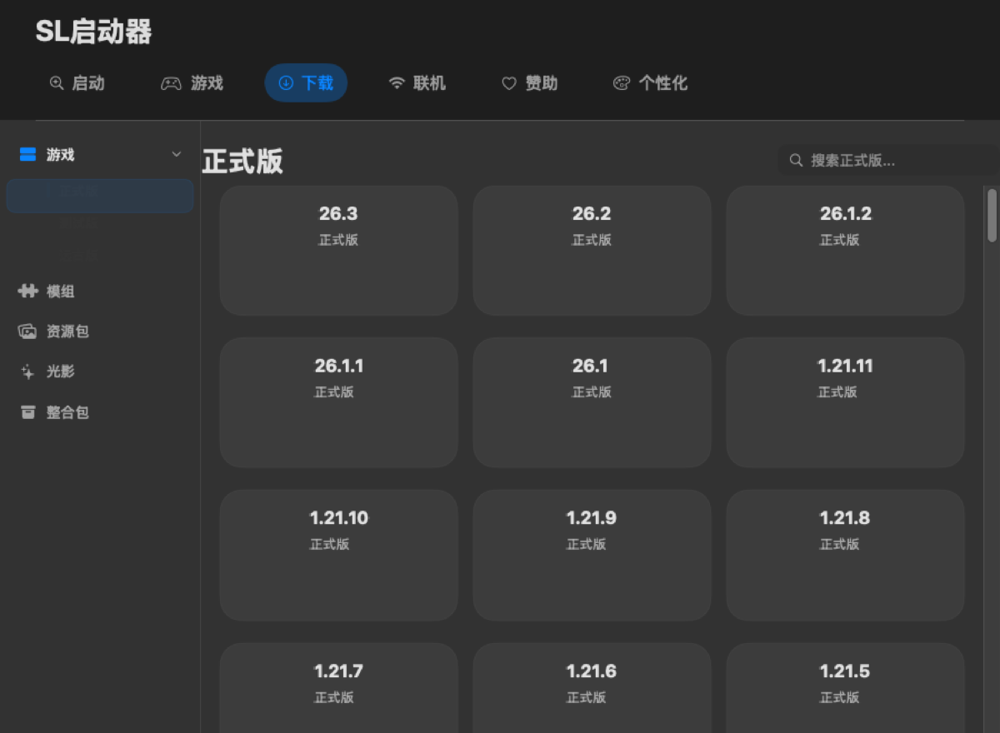

**所见**：左侧栏（游戏 / 模组 / 资源包 / 光影 / 整合包，展开子项「正式版」）+ 右侧 24pt 标题
「正式版」+ 右上「搜索正式版...」+ 3 列版本卡网格，每卡两行文字（版本号 + 「正式版」）。

| # | 级别 | 问题 | 建议 |
|---|---|---|---|
| C-1 | ~~P0~~ **撤下** | **经复核为渲染假象，不是缺陷** —— 详细论证与自我纠正见第〇节末（`?? 0` 改 `?? 1` 是空操作，因为字典初值已覆盖全部三个 case）。 | 无需改动。可选的防御性优化：把初值改由 `GameSubCategory.allCases` 派生，避免将来新增 case 时漏填而静默隐形。 |
| C-2 | P1 | **版本卡信息密度过低**：卡片约 265×115，只有居中两行字，没有图标、体积、发布时间、安装状态等任何信息。660pt 高的窗口一屏只能看到约 4 行版本。 | 每卡补「发布时间 + 是否已安装」；或把卡压扁成列表行（高 56–64pt），一屏可看 8–10 个版本。 |
| C-3 | P2 | 标题「正式版」与搜索框在同一水平线，但一个贴左、一个贴右且基线不对齐，中间空出约 400pt。 | 让搜索框与标题基线对齐；或把搜索框移到标题下方、占满剩余宽度。 |
| C-4 | P2 | 侧栏「游戏」用强调色图标，其余用次级色 —— 但它既不是当前选中项也没被标记为展开，彩色图标在这里语义不明。 | 只在「该分区被选中或其子项被选中」时用强调色。 |

---

## 四、联机页

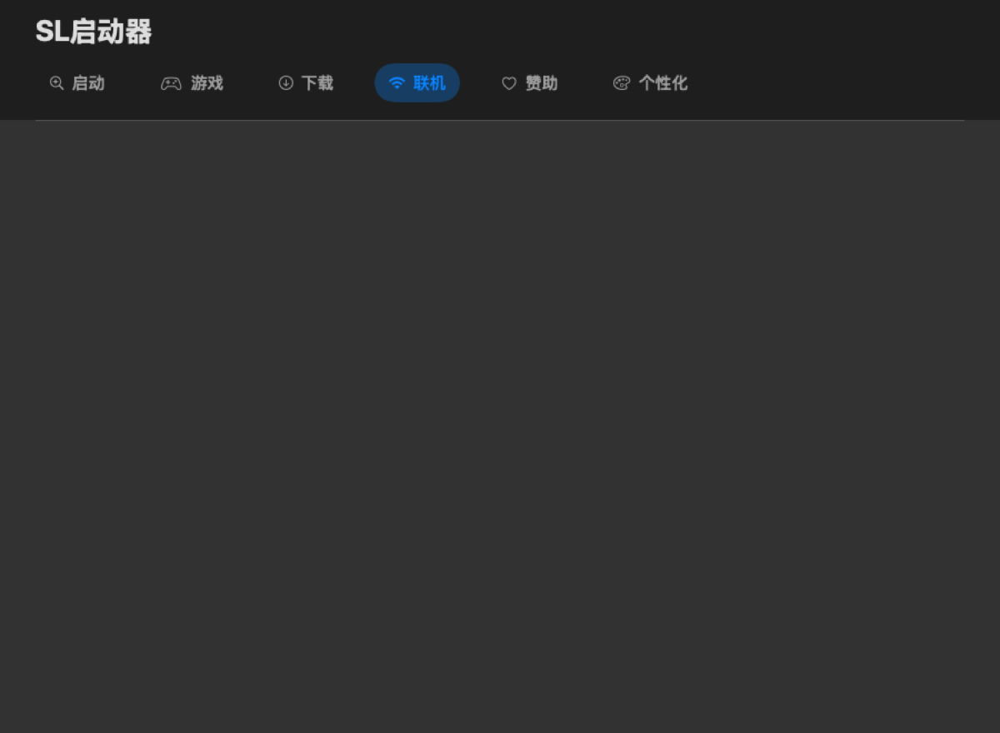

**所见**：**整页空白**——深色背景，没有文字、没有图标、没有任何提示。

| # | 级别 | 问题 | 建议 |
|---|---|---|---|
| D-1 | **P0** | 用户点「联机」看到一片空白，最容易被判断成「应用坏了」。源码里这一分支就是一个空的 `LazyVGrid`（`CategoryContentView.swift:244-251`）。 | 接入统一空态组件：图标 + 标题「联机功能开发中」+ 一句说明（例如「后续版本支持局域网与服务器列表」）。**注意**：本轮死代码清理刚删掉 `ComingSoonCardView`（全库零引用）—— 也就是说「待开发占位」这个组件写了却从没接上过，正好借这次接上（或换一个新的统一空态）。 |

---

## 五、赞助页

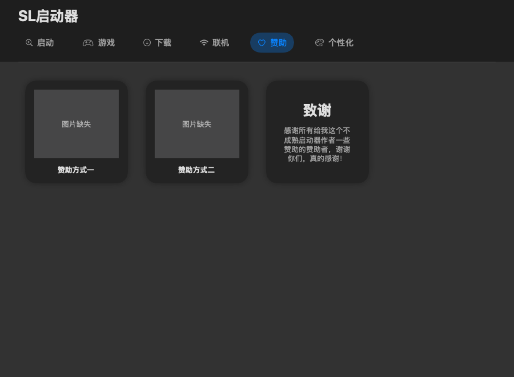

**所见**：三张卡 —— 「赞助方式一」「赞助方式二」（各 `frame(180×180)`，上图片下标题）+
「致谢」卡（5 行文案）。**图片缺失是渲染假象，见第〇节。**

| # | 级别 | 问题 | 建议 |
|---|---|---|---|
| E-1 | P1 | **卡片尺寸不齐**：`SponsorCard` 固定 180×180，而「致谢」卡是另一个尺寸，三张并排时宽高都不一致，像没对齐的网格。 | 全部纳入同一个等宽网格（例如 `LazyVGrid(columns: 3, spacing: 20)` + `.frame(maxWidth:.infinity)`），或把「致谢」单独放一行占满宽度。 |
| E-2 | P1 | **致谢文案句子不通**：「感谢所有给我这个不成熟启动器作者一些赞助的赞助者，谢谢你们，真的感谢！」——「给我这个不成熟启动器作者一些赞助的赞助者」结构绕。 | 建议改为：「感谢每一位赞助者，谢谢你们支持这个还很不成熟的启动器！」 |
| E-3 | P2 | 致谢卡的正文行宽约 150pt，中文在词中间断行，5 行密排且无 `lineSpacing`。 | 提高卡片宽度或降字号，并加 `lineSpacing(3~4)`；正文左右内边距至少 16pt。 |
| E-4 | P2 | 整页 2/3 空白，三张卡挤在左上角，没有居中或铺开的排版意图。 | 与 A-1 一并处理（统一各分类页的「内容区容器」规则：居中 / 左对齐 / 最大宽度）。 |

---

## 六、个性化页（事实上是设置页）

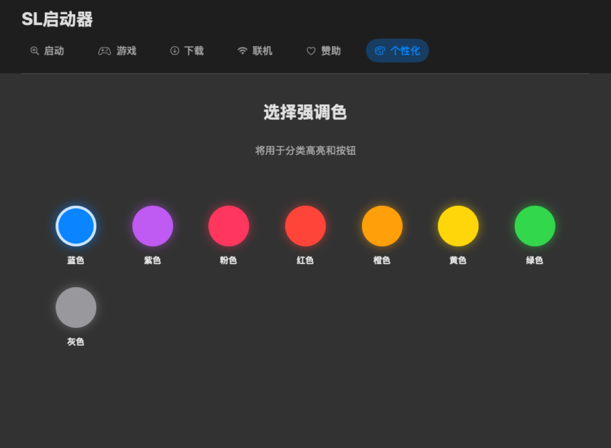

**所见**：「选择强调色」32pt bold + 「将用于分类高亮和按钮」+ 8 个 60×60 色圆（带同色辉光）
+ 名称标签，选中项有白色环；**第 8 个「灰色」被挤到第二行，形成 7+1 的排布**。

| # | 级别 | 问题 | 建议 |
|---|---|---|---|
| F-1 | **P0** | **7+1 的换行**看起来像 bug（7 个一行、1 个孤零零在下面）。 | 固定列数：`LazyVGrid(columns: Array(repeating: .init(.flexible()), count: 4))` → 4×2；或让 8 个圆等分宽度自适应（`HStack` + `.frame(maxWidth:.infinity)`）。 |
| F-2 | P1 | **颜色是唯一区分手段，且没有任何无障碍名称。** 全项目 `accessibilityLabel` 数量为 **0**；「粉色 / 红色 / 橙色 / 黄色」四个相邻色对色觉障碍用户不可分。 | 每个色圆加 `accessibilityLabel("强调色：粉色")`；选中态除白环外再加一个勾形（形状 + 颜色双通道）。 |
| F-3 | P1 | **同一窗口内三套标题字号并存**：窗口标题「SL启动器」= `largeTitle`（约 26pt）、本页「选择强调色」= 32pt、下载页「正式版」= 24pt。 | 定义「页面标题」一个 token（建议 24pt bold），全部页面统一。 |
| F-4 | P2 | 页面叫「个性化」，但里面**只有强调色一项**。用户会以为还有主题 / 字体 / 明暗模式。 | 要么改名为「外观」，要么补齐几项（例如明暗模式跟随系统 / 字体大小）。 |
| F-5 | P2 | 8 个圆各带同色辉光，凑在一起视觉噪音偏大；选中白环与未选中的辉光强度接近，**选中态不够突出**。 | 未选中去掉辉光（或降到 0.15 以下），选中用白环 + 放大 + 勾三种手段叠加。 |

---

## 七、下载详情页

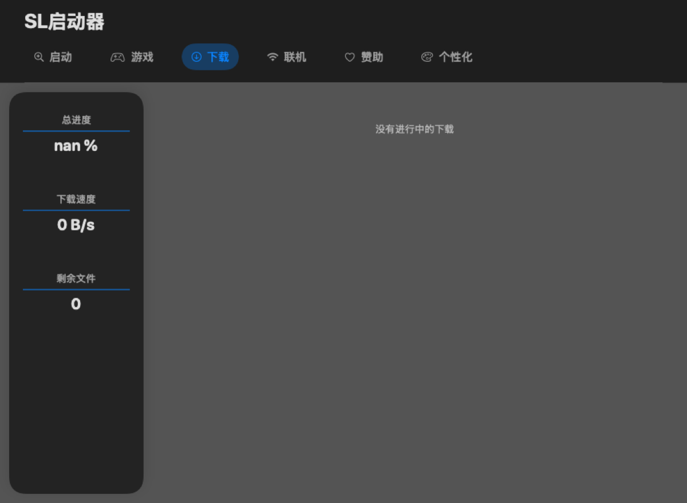

**所见**：左侧 176pt 宽毛玻璃圆角面板（总进度 / 下载速度 / 剩余文件，各带标题 + 分隔线 + 数值），
右侧空态「没有进行中的下载」。

| # | 级别 | 问题 | 建议 |
|---|---|---|---|
| **G-1** | **P0（真实缺陷，非渲染假象）** — **本轮已修** | **总进度显示字面量 `nan %`。** 根因已定位到源码级：视图的守卫是 `manager.tasks.totalFiles < 0 ? "未知" : String(format: "%.1f %%", getProgress() * 100)`（`DownloadDetailView.swift:20`）。但 `manager.tasks` 的类型是 `InstallTasks`，它的 `totalFiles` 是**求和**得到的计算属性（`InstallTask.swift:162`），空集合时是 **0 而不是 -1**；而 `InstallTasks.getProgress()`（`InstallTask.swift:174`）**没有** `totalFiles > 0` 的守卫 —— 同名的单任务版本 `InstallTask.getProgress()`（`:114-115`）**有**这个守卫。于是 0/0 = NaN，被 `String(format:)` 原样打印。 | 与 `:114` 对齐，在 `InstallTasks.getProgress()` 首行加 `guard !tasks.isEmpty else { return 0 }`（守卫除数本身，比守卫 `totalFiles` 更贴实）。**本轮已修。** |
| G-2 | P1 | **数值单位三种排版规则**：「总进度」= `%.1f %%` → `52.3 %`（数字与 % 之间有空格）、「下载速度」= `MB/s`（无空格）、「剩余文件」= 纯数字。 | 统一：百分比不带空格（`52.3%`），速度带空格（`12.4 MB/s`），并区分「数值」与「单位」的字号/颜色。 |
| G-3 | P1 | 左面板宽度 176pt、高度拉满整窗（约 470pt），但**内容只占顶部约 230pt**，下面 240pt 是一条空的圆角条，重心明显偏高。 | 面板高度改为按内容自适应；或用下半部分放「当前下载源 / 已下载字节 / 预计剩余时间」。 |
| G-4 | P2 | 左面板用 `.regularMaterial`（系统材质），右侧空态是纯文字，而主界面卡片用主题/次级色 —— **同一窗口三套容器语言**。 | 统一「卡片」的材质与圆角（见第 O 节的令牌化建议）。 |
| G-5 | P2 | 空态「没有进行中的下载」13pt 次级色、`.padding(.top, 40)` 顶部对齐，在整片右侧区域里显得漂浮。 | 整块区域居中显示（图标 + 文案 + 「去下载」引导）。 |

---

## 八、Java 环境下拉

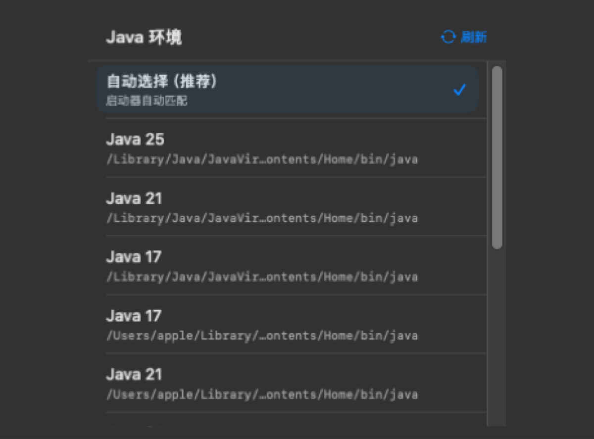

**所见**：标题「Java 环境」+「刷新」+ 列表：「自动选择（推荐）」带勾 → Java 25 → Java 21 →
Java 17 → Java 17 → Java 21，每项两行（名称 14pt + 路径 11pt 次级色、**中间省略号截断**）。

| # | 级别 | 问题 | 建议 |
|---|---|---|---|
| **H-1** | **P1（真实可用性缺陷）** | **路径被截断到「4 个不同 JDK 显示成同一串」**：6 项里有 4 项显示为完全相同的 `/Library/Java/JavaVir…ontents/Home/bin/java`。而路径是唯一能区分同名项的信息 → **用户无法选择正确的 JDK**。 | 截断转到尾部（保留 JDK 根目录名，如 `…/temurin-21.jdk/…`）；或改成显示来源（`系统` / `用户目录` / `自定义`）；或路径可悬停展开全文。 |
| H-2 | P1 | **列表出现同名重复项**（两个「Java 17」、两个「Java 21」）。扫描把 `/Library/Java/JavaVirtualMachines` 与 `~/Library/Java/JavaVirtualMachines` 下的 JDK 全列了出来，没有去重也没有来源标注。 | 按「JDK 根目录」去重，保留一个并标注来源；或在每组前加分组标题。 |
| H-3 | P2 | 列表项行高约 48pt + `maxHeight 280` → 一屏只能看 5 项多，滚动条常驻；而实际内容只有 7 项。 | 把行高压到 40pt 以内（副标题可只在选中时显示），或把 `maxHeight` 提到 360。 |
| H-4 | P2 | 同一列承载两种语义：推荐项的副标题是**解释**（「启动器自动匹配」），其它项的副标题是**路径**。 | 推荐项的副标题也改成路径（或统一「推荐」用一个角标表示）。 |
| H-5 | P2 | 这是**全项目唯一用 `.popover` 的界面**，其余「弹窗」都是手写 ZStack 浮层 —— 系统 popover 自带边框/箭头/点击外部关闭，与手写浮层的视觉语言不同。 | 二选一：要么把这个也改成手写浮层（统一），要么把浮层逐步换成系统 popover（更省事且行为更标准）。 |

---

## 九、启动按钮（动画状态矩阵）

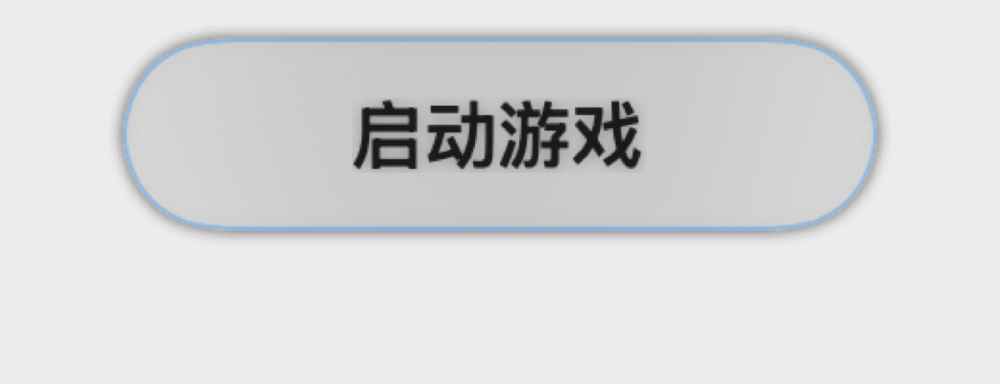
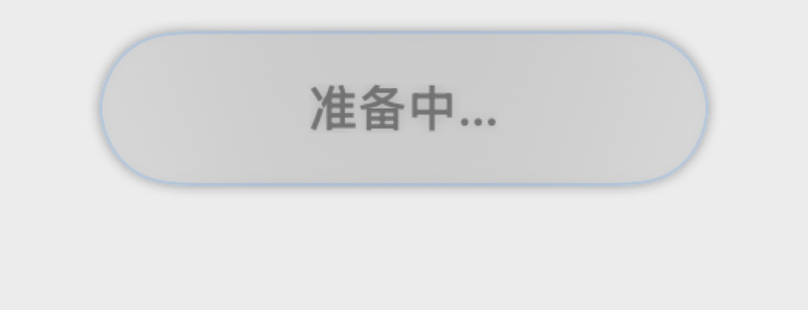
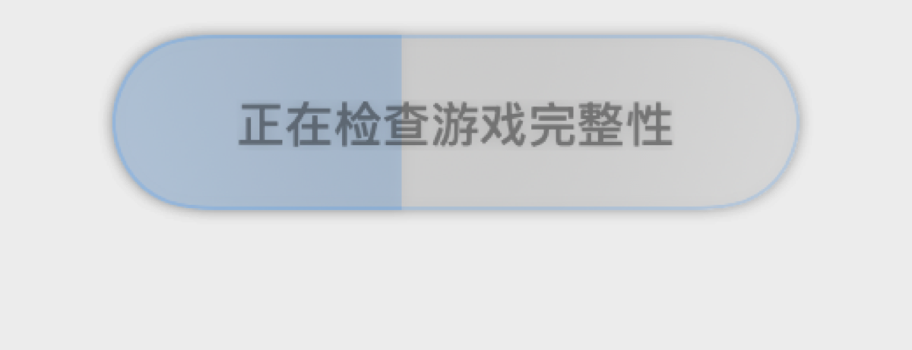
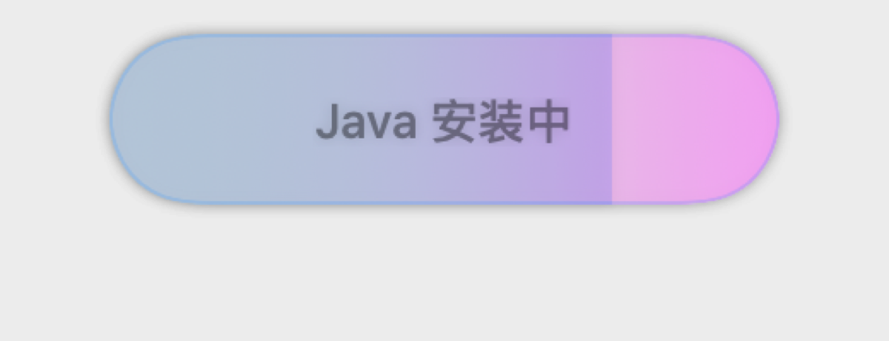
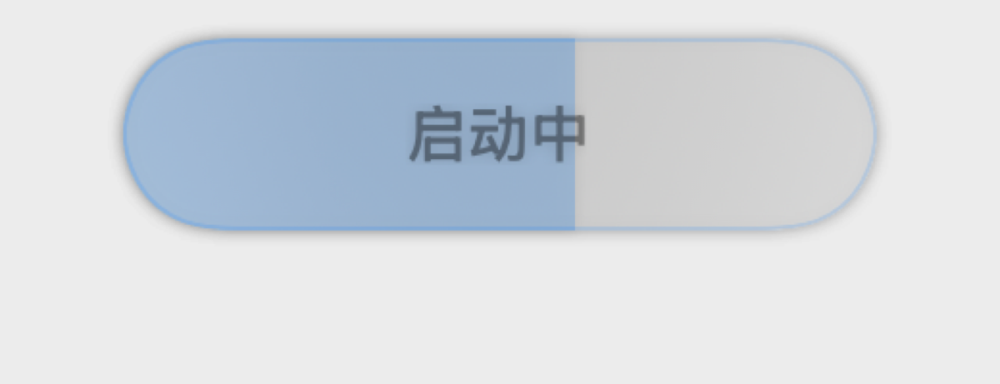

五个相位与禁用态全部渲染成功（这一组是**真实可信**的，按钮不依赖 `onAppear` 入场）。

| 相位 | 文案 | 字号 | 进度条 |
|---|---|---|---|
| idle | 启动游戏 | 20pt | 无 |
| preparing | 准备中… | 16pt | 无 |
| downloading | 正在检查游戏完整性 | 14pt | 强调色 0.6，浅 |
| installing | Java 安装中 | 14pt | 强调色 0.6，浅 |
| launching | 启动中 | 16pt | 强调色 0.85，深 |

| # | 级别 | 问题 | 建议 |
|---|---|---|---|
| I-1 | P1 | **同一按钮内三档字号（14 / 16 / 20）**，切相位时文字大小会跳变；最长的「正在检查游戏完整性」只能靠最小的 14pt 塞进 196pt 宽。 | 统一定在 16pt；若文案放不下，缩短文案（「检查完整性」）而不是缩字号。 |
| I-2 | P1 | **进度进行中，按钮文字被「禁用态」调暗。** `isLaunching` 时按钮 `.disabled(true)`（`LaunchButton.swift:130`），SwiftUI 会把标签整体降透明度 —— 截图里「准备中…」「启动中」明显比 idle 的「启动游戏」灰。**而进度反馈恰恰是用户此刻最需要读的信息，却被调得最淡。** | 用 `.allowsHitTesting(false)`（或 `Button` 之外的 `onTapGesture` + 自管 `isEnabled`）替代 `.disabled`；若必须用 `.disabled`，就在禁用态显式覆盖前景色与材质。 |
| I-3 | P2 | 进度条是 `Rectangle` 直接放进 `ZStack(alignment:.leading)` 再用 `mask(RoundedRectangle(25))` 裁 —— 填充自身的右边缘是**直角**，中途进度（42% / 60%）时胶囊里会出现一条生硬的竖直硬边。 | 填充改用 `RoundedRectangle(cornerRadius: 25)`，或对填充单独 `clipShape`，做成「液面」观感。 |
| I-4 | P2 | 相位切换有 **800ms 的「死动画」锁**（`LaunchButton.swift:47`），期间新相位只能排队。短命相位连着来（准备中 → 正在检查 → Java 安装中）时，按钮显示会明显滞后于真实状态。 | 把锁时长降到实际 spring 完播时长（`spring(0.5)` ≈ 350–400ms），或改成「后到者覆盖」而不是排队。 |
| I-5 | P2 | 点击反馈是 150ms 的 1.15 倍弹跳，但 launching 相位按钮是 disabled 的，点击没有反馈 —— 同一控件两种手感。 | 若采用 I-2 的改法（不再用 `.disabled`），顺手让所有相位的点击都有反馈。 |

---

## 十、右下角电源按钮（仅源码评审）


三张截图（launching / running / hidden）都是空白 —— **渲染局限，不是缺陷**（见第〇节第 2 条）。
以下结论全部来自 `CloseSessionButton.swift` 源码。

**实现**：44×44 圆 + `.regularMaterial` 填充 + 2.5pt 强调色圆环 + `power` 图标 18pt；
入场三段动画：1.3（`spring 0.45/0.55`，含辉光 0.8）→ 0.85（`0.35/0.6`）→ 1.0（`0.3/0.7`）。

| # | 级别 | 问题 | 建议 |
|---|---|---|---|
| J-1 | P2 | **1.3 倍过冲与全站手感不符。** 全项目其它控件的点击/入场过冲集中在 **1.06–1.15**（见第 L-2 节），这里是唯一「先放大到 1.3、再回弹到比原尺寸小的 0.85」的曲线。而且圆环同时 `scaleEffect(×1.8)`，在 44pt 圆上等于瞬间撑到 79pt，小窗口里会「弹」出来。 | 过冲收到 1.15 以内；圆环的 1.8 倍单独降下来或改成透明度渐入。 |
| J-2 | P3 | `help` 文案有两态（「关闭所有游戏」/「取消启动」），但图标恒为 `power` —— 用电源图标表示「取消启动」语义偏差。 | 取消启动用 `xmark.circle` 或 `stop.circle`，运行中用 `power`。 |

---

## 十一、任务药丸 / 失败药丸（仅源码评审）


截图空白（`TaskPill.opacity` 初值 0 + `onAppear` 入场，渲染局限）。以下来自 `TaskPill.swift` +
`RootOverlays.swift`。

**实现**：16pt medium 白字 + `.ultraThinMaterial` 圆角 20 + 水平内边距 20。
两个入口共用同一个组件，**唯一差异是停留时长**：任务态 1.5s / 失败态 6s。

| # | 级别 | 问题 | 建议 |
|---|---|---|---|
| K-1 | P2 | **锚点是绝对坐标 `(450, 200)`**（`RootOverlays.pillAnchor`）。窗口最小宽 800 时它在中间偏右；窗口拉宽到 1600 时它还是 450 —— **不随窗口宽度自适应，会偏到左侧**。 | 改为相对锚点：`VStack { pill; Spacer() }.frame(maxWidth:.infinity, alignment:.top)` + `padding(.top, …)`，或 `.overlay(alignment: .top)`。 |
| K-2 | P2 | 白字放在 `.ultraThinMaterial` 上，在**浅色桌面 / 浅色窗口**下材质会透出背景，对比度不足（这是全项目唯一「白字 + 半透明材质」的组合）。 | 加一层 `Color.black.opacity(0.35)` 底，或改用 `.regularMaterial` / `.thickMaterial`。 |
| K-3 | P3 | 药丸自身也做「弹入 + 自动缩回」（`exaggeratedSpring` 入 / `explosiveSpring` 出），与顶部横幅的入场曲线不同（见 L-2）。 | 统一到同一组「提示类」曲线。 |

---

## 十二、顶部通知横幅（四个级别）

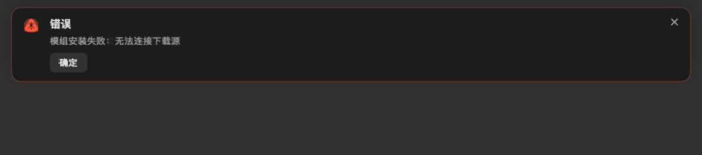
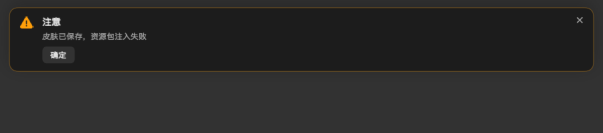

error / warning 两级的真实外观（info / success 空白，待真机确认）。
**实现**：图标 + 标题 14pt bold + 正文 12pt 次级色 + 按钮组 + 右上 ✕，卡片带同色系边框。

> **一处澄清**：我一开始以为「传了 `allowsReportExport: true` 就该多出一个『导出错误报告』按钮」，
> 但测试用例 `testAllowsReportExportOnlyDependsOnButtonLabels` 明确写了
> **「导出仅由按钮文案决定」** —— 所以截图里只有一个「确定」是**正确行为**，不是缺陷。

| # | 级别 | 问题 | 建议 |
|---|---|---|---|
| L-1 | P1 | **横幅铺满整个窗口宽度**（`.padding(.horizontal, 16)`），但正文只有十几个字：900pt 宽的横幅里内容占约 30%，右侧 ✕ 距离正文 600pt 以上 —— 视线要横跨半个屏幕才能找到关闭按钮。 | 给卡片加 `maxWidth`（建议 420–480）并水平居中；或让内容右对齐、✕ 紧跟内容。 |
| L-2 | P1 | **四个级别的颜色是硬编码系统色**（`.blue / .green / .orange / .red`，`NoticeOverlay.swift:47-50`），而全局强调色是用户可配置的（`accentColor` 在全库用了 57 处）。用户把强调色设成橙色时，「注意」级的橙色会与强调色语义打架。 | 级别色进主题令牌；另建议降低级别色的饱和度（现在四个色都很艳），或用「图标形状区分级别 + 同色边框」降低色彩冲突。 |
| L-3 | P2 | **错误级只有「确定」一个按钮**，没有「复制错误 / 打开日志 / 查看详情」任何出口。用户唯一能做的就是把它关掉 —— 虽然不再是「静默失败」，但仍然是「告知即止」。 | 错误级默认带一个「查看日志」或「复制错误信息」按钮（`buttons` 里加即可，机制已经支持）。 |
| L-4 | P2 | info / success **4s 自动消失**、warning / error **手动关闭** —— 规则不同却没有任何视觉暗示（没有倒计时条）。 | 自动消失的那两级加一条细倒计时进度条，用户就知道「不用管它」。 |
| L-5 | P2 | 卡片内层级：按钮紧贴正文下方约 8pt，视觉上像正文的一部分。 | 按钮与正文之间留 12–14pt，或给按钮加轻微上边框分隔。 |

---

## 十三、拖拽高亮

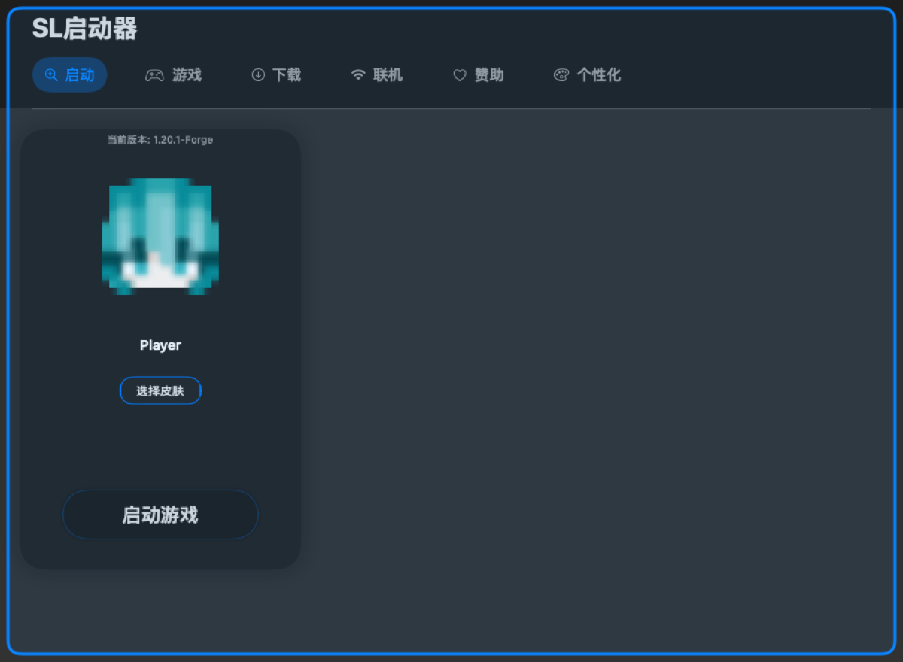

**所见**：整窗 3pt 强调色描边 + 圆角 12，内缩约 10pt。渲染清晰（这一张**可信**）。

| # | 级别 | 问题 | 建议 |
|---|---|---|---|
| M-1 | P3 | 实际只有窗口能接收 drop，所以「整窗高亮」语义正确；但 **3pt 线宽是全项目最粗的描边**（全库描边线宽有 0.5 / 1 / 1.5 / 2 / 3 五档并存）。 | 纳入描边令牌（建议「状态高亮 = 2pt」）。 |

---

## 十四、动画专项：跨界面一致性

**现状普查**：全库 **38 组关键帧动画 + 25 处 `.animation(_:value:)` + 9 处 `.transition` +
3 处计时器驱动的「假动画」**。没有 `matchedGeometryEffect`、没有 `PhaseAnimator`、
没有 `TimelineView`、没有自定义 `Animatable`。

| # | 级别 | 问题 | 建议 |
|---|---|---|---|
| N-1 | P1 | **常量命名与语义脱节，且命名常量覆盖率不到一半。** `AnimationExtensions` 里保留的 `explosiveSpring / exaggeratedSpring / punchySpring` 是纯情感化命名（名字不表达参数差异），而视图里还散落 **30+ 处裸 spring 字面量**。 | 改成按**用途**命名：`cardSelect` / `panelPresent` / `sheetDismiss` / `contentSwitch` / `progressFollow` / `alertEnter`，并把裸字面量全部收编。 |
| N-2 | P1 | **「同一个交互用了不同曲线」至少 5 组**：<br>① 切换内容：分类导航 `spring(0.52,0.58)` vs 侧栏 `spring(0.5,0.7)+easeInOut(0.12/0.18)` vs 详情页进出 `spring(0.45,0.82)/easeInOut(0.25)`<br>② 卡片点击放大：`ContentCard` 1.06（`spring(0.4,0.5)`）vs `VersionButton` 1.08（`punchySpring`）vs `PrerequisiteModCard` 1.06 vs `LoaderSelectorCard` 1.08 vs `VersionLoaderCard` 1.08<br>③ 弹窗入场：安装弹窗 `spring(0.4,0.7)` vs Java 面板 `spring(0.5,0.7)` vs 详情页 `interpolatingSpring(mass:1,stiffness:240,damping:14,initialVelocity:8)`<br>④ 通知入场：药丸 `exaggeratedSpring`/`explosiveSpring` vs 横幅 `exaggeratedSpring`/`punchySpring` | 定义**四类标准曲线**（入场 / 退场 / 选中反馈 / 内容切换）各一套参数，逐处替换；只有确实需要特殊节奏的地方才允许例外，并写注释说明为什么。 |
| N-3 | P2 | **时长没有档位**：0.12 / 0.18 / 0.25 / 0.3 / 0.35 / 0.4 / 0.45 / 0.5 / 0.6 / 0.7 / 0.8 / 0.9 并存；另有 3 处手写秒数（800ms 相位锁、250ms + 200ms 电源弹入、150ms 点击弹跳）。 | 收敛到 3 档：**150ms（反馈） / 250ms（入场） / 400ms（页面切换）**，spring 响应统一到 0.35 / 0.5 / 0.7。 |
| N-4 | P2 | **「假进度」有两套实现、视觉上分不出来。** 启动按钮的深色进度由 `LaunchSessionManager` 里一个 `Timer(0.05s)` 逐步逼近 1.0（永远爬不到头），而下载进度来自真实任务 —— 两者渲染成**同一条 `Rectangle`**，用户无法分辨哪个是真进度。 | 给「不确定进度」独立视觉（条纹 / 脉动 / 无端点），或干脆只展示真实进度。 |
| N-5 | P2 | 「检索中」的省略号是**手写计时器**（0.5s 让点号在 1→4 循环），而应用其它地方用 `ProgressView` —— 同一语义两种实现。 | 统一用 `ProgressView`（见 B-1）。 |
| N-6 | P3 | **没有「减弱动态效果」适配。** 全库没有一处 `@Environment(\.accessibilityReduceMotion)`。系统开启「减弱动态效果」后，1.2 / 1.15 / 1.3 倍的弹跳与整页滑动仍会全速播放。 | 在统一的动画入口读一次 `reduceMotion`，为真时把 spring 换成 `easeInOut(0.15)` 或直接 `.none`。 |

---

## 十五、设计一致性专项（硬编码值普查）

这节是「会不会重新变成屎山」的核心证据。

| 维度 | 使用次数 | 用到几种值 | 具体分布 |
|---|---|---|---|
| 字号 `.font(.system(size:))` | 99 | **17 种** | 9 / 10 / 11 / 12 / 13 / 14 / 15 / 16 / 18 / 19 / 20 / 24 / 26 / 28 / 32 / 36 / 48 |
| 圆角 `cornerRadius` | 64 | **12 种** | 0 / 1.5 / 4 / 5 / 6 / 8 / 12 / 16 / 20 / 24 / 25 / 28 |
| 间距 `spacing:` | 89 | **13 种** | 0 / 2 / 3 / 4 / 6 / 8 / 10 / 12 / 14 / 16 / 20 / 24 / 32 |
| 内边距 | 24+ 种 | — | 含 90 / 60 / 56 / 50 / 42 / 30 / 28 / 18 / 7 / 5 / 3 等一次性值 |
| 按钮高度 | — | **5 种** | 32（弹窗按钮）/ 40（寻找版本）/ 44（详情返回）/ 50（启动按钮、进度条）/ 60 |
| 描边线宽 | — | **5 种** | 0.5 / 1 / 1.5 / 2 / 3 |
| 颜色 | — | 系统色 | **零自定义色值**（无 `Color(red:green:blue:)`、无 hex）—— 这点很好 |

**同类概念的具体冲突证据**：

- **「卡片」圆角同时是 24**（启动卡、版本卡）/ **20**（下载详情左面板）/ **16**（任务卡）/ **12**（通知卡）
- **「标签胶囊」圆角同时是 4 / 5 / 6**
- **「卡片描边」用了 4 种透明度**：0.05 / 0.06 / 0.08 / 0.2
- **间距 4→6→8→10→12→14→16 呈「逐 2 递增」的连续分布** —— 典型的随手调值，没有任何栅格
- **「成功绿 / 失败红」有两套独立硬编码**：`NoticeOverlay` 的通知级别色 vs `DownloadDetailView` 的阶段状态色

**主题体系现状（最关键的结论）**

`qwq/Features/Theme/` 下只有 `ThemeDefinition { let accentColor: Color }` —— **一个字段**，
外加三层 DI 管道（`ThemeService` / `ThemeRepository` / `ThemeModule`）。
**没有任何字号 / 圆角 / 间距 / 透明度 / 线宽令牌。**
而且视图层真正消费的是旧兼容层 `ThemeManager.shared.accentColor`（57 处），
`Theme/` 目录里的 `ThemeService` 在视图层**零调用**。

> 也就是说：现在所谓的「主题体系」只管一个强调色。
> 上面那 17 种字号、12 种圆角、13 种间距全部是裸字面量。
> **这是「重新变成屎山」的最大结构性入口。**

**建议**（按收益排序）：

1. 在 `Theme/` 下加一个 `DesignTokens`（纯静态枚举，无 DI）：
   `FontSize`（建议只留 11 / 12 / 13 / 16 / 20 / 24 六档）、
   `Radius`（建议 4 / 8 / 12 / 16 / 24 五档）、
   `Spacing`（建议 4 / 8 / 12 / 16 / 24 五档）、
   `Stroke`（建议 0.5 / 1 / 2 三档）、`Opacity`（描边 0.08 / 0.15 两档）。
2. 新代码一律用令牌；旧代码**按界面增量替换**（改到哪个界面就换哪个界面），不要为了换而换。
3. 给「页面标题 / 卡片标题 / 正文 / 辅助文字」四类文字各定一个组合令牌（字号 + 字重 + 颜色），
   避免 `font + foregroundColor` 每次手写。

---

## 十六、无障碍专项

| 项目 | 现状 |
|---|---|
| `accessibilityLabel` / 任何 `accessibility*` | **0 处** |
| `.help()` tooltip | **2 处**（电源按钮、日志卡关闭） |
| 无文字纯图标按钮 | **≥ 8 个**，既无 label 也无 tooltip：全局圆形下载按钮、搜索清空、两个弹窗关闭、通知关闭、详情返回、日志关闭、Java 刷新 |
| 颜色作为唯一选中标识 | 强调色选择器（8 个色圆）、分类导航 |

**最低成本的三件事**（预计改动量很小，收益最直观）：

1. 给那 8 个纯图标按钮各补一句 `.help("…")`（鼠标悬停即可看到，也是无障碍名称的主要来源）。
2. 给 8 个色圆补 `accessibilityLabel("强调色：<名称>")`，选中态加勾形。
3. 给「游戏检索中」「下载中」这类纯文字状态补 `accessibilityLabel`，让读屏知道在忙什么。

---

## 十七、按优先级汇总

### P0 —— 建议立刻修（三个都很小）

1. ~~**下载详情页总进度 `nan %`**~~ —— **本轮已修**（`InstallTask.swift:174` 加了
   `guard !tasks.isEmpty else { return 0 }`，即空集合时不再做 0/0 除法）。
2. **「联机」页整页空白** —— 接入空态组件（图标 + 「开发中」+ 说明）
3. **个性化页 8 色 7+1 换行** —— 固定 4×2 网格

### P1 —— 本轮迭代

4. Java 选择器：路径截断导致 4 项显示同一串 + 同名重复项（**用户选不对 JDK**）
5. 启动按钮：相位文案 14/16/20 三档字号 + 禁用态把进度文案调暗
6. 启动页右 2/3 空白（信息架构）
7. 通知横幅铺满整窗宽、✕ 距离正文 600pt+
8. 通知四级别颜色硬编码，与可配置强调色冲突
9. 错误级通知缺「查看日志 / 复制」出口
10. 动画曲线收敛（≥5 组「同交互不同曲线」）+ 情感化命名改语义化
11. 设计令牌化（字号 / 圆角 / 间距 / 线宽 / 透明度）
12. `accessibilityLabel` 从 0 到「所有纯图标按钮」

### P2 —— 择机

13. 版本卡信息密度过低（265×115 只有两行字）
14. 赞助页三张卡尺寸不齐 + 致谢文案语病
15. 下载页数值单位排版不统一（`52.3 %` / `MB/s` / `0`）
16. 药丸锚点绝对坐标 `(450,200)` 不随窗口宽自适应
17. 药丸白字在浅色材质上对比度不足
18. 进度条右边缘直角（胶囊内出现硬竖直边）
19. 无「减弱动态效果」适配
20. 启动卡内 180pt 硬留白
21. 电源按钮 1.3 倍过冲与全站 1.06–1.15 手感不符
22. 游戏页加载态是 48pt 巨字 + 手写省略号
23. 游戏页检索失败无错误态

### P3 —— 有空再说

24. `.popover` 与手写浮层两套弹窗语言并存
25. 「待开发」占位组件写了没接上（`ComingSoonCardView` 本轮已作为死代码删除）
26. 描边五档线宽收敛
27. 电源按钮「取消启动」用 `power` 图标语义偏差

**已撤下 1 条**：原 C-1「侧栏子项标签默认不可见」经复核是渲染假象（见第〇节末）。
上表共 **27 条**待办，其中 1 条（`nan %`）本轮已修。

---

## 十八、本轮改了什么 / 没做什么

**代码：只改了 1 行（外加 4 行注释）。**

- `qwq/SLCore/Minecraft/Download/InstallTask.swift:174` `InstallTasks.getProgress()`
  补 `guard !tasks.isEmpty else { return 0 }`。这是上面 G-1 那条 `nan %` 的根因，
  属于**数值校验缺陷**（0/0 = NaN 且 NaN 穿透所有比较运算），不是风格问题，故本轮直接改。
  验证：`typecheck.sh` 两口径 0 error；`verify-build.sh` ** BUILD SUCCEEDED **。

**没做：**

- **没有改任何 UI 代码。** 上面 27 条**其余全部只是建议** —— 没有改配色、没有调间距、
  没有动动画参数、没有加空态、没有动网格列数。
- 截图是**离屏渲染**，不是真机屏幕截图。可信度边界见第〇节。
- 本文在成稿后**撤回了自己的一条 P0 结论**（原 C-1），因为复核发现推荐的那一行是空操作。
  保留这条纠正记录，是为了说明本文其余结论都经过了同等级别的复核。
